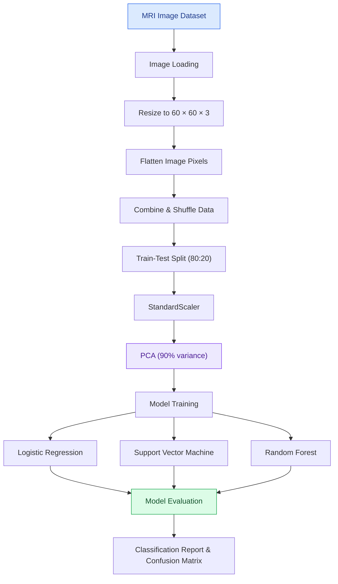

# Alzheimer’s Disease Detection Using MRI Images
### Machine Learning | Image Processing | PCA | Classification

<p align="center">
  
  
  
  
</p>

<p align="center">
  <b>Exploring MRI-based image classification to distinguish between different stages of Alzheimer's-related dementia.</b>
</p>

---

## Overview

Alzheimer's disease is a progressive neurological condition that affects memory, thinking and behavior. Medical imaging, including MRI scans, can provide valuable information for studying changes in the brain.

This project explores a machine learning approach to classifying brain MRI images into four categories using image preprocessing, dimensionality reduction and supervised learning algorithms.

The project uses **Principal Component Analysis (PCA)** to reduce the dimensionality of image data and compares Logistic Regression, Support Vector Machine (SVM) and Random Forest classifiers to study their classification performance.

> **Disclaimer:** This is an educational machine learning project, not a clinically validated diagnostic system. Its predictions must not be used for medical diagnosis or treatment decisions.

## Objectives

- Process and prepare MRI images for machine learning.
- Explore class distributions and visualize image data.
- Apply feature scaling and PCA for dimensionality reduction.
- Train and compare multiple classification algorithms.
- Evaluate model performance using accuracy, precision, recall and confusion matrices.
- Explore the effectiveness of traditional machine learning techniques for MRI image classification.

## Dataset

The project uses the <a href="https://www.kaggle.com/datasets/sachinkumar413/alzheimer-mri-dataset">Alzheimer MRI Dataset from Kaggle</a>.

The dataset contains MRI images organized into four classes:

| Class | Description |
|---|---|
| Non-Demented | MRI images categorized as non-demented |
| Very Mild Demented | MRI images categorized as very mild dementia |
| Mild Demented | MRI images categorized as mild dementia |
| Moderate Demented | MRI images categorized as moderate dementia |

The images are resized to **60 × 60 × 3** and flattened into feature vectors for processing with traditional machine learning algorithms.

## Project Workflow



## Methodology

### 1. Image Preprocessing

MRI images are loaded from their respective class folders and resized to a uniform resolution of 60 × 60 pixels with three channels.

Each image is then flattened into a one-dimensional feature vector, and the vectors are combined into a dataset with corresponding class labels.

### 2. Exploratory Data Analysis

The notebook explores the distribution of the four classes using visualizations, including class-wise distribution plots and pair plots of the principal components.

### 3. Train-Test Split

The dataset is divided into training and testing subsets:

- Training data: 80%
- Testing data: 20%

The split uses a fixed random seed to support reproducibility.

### 4. Feature Scaling and PCA

`StandardScaler` is used to standardize the image features, followed by Principal Component Analysis.

PCA retains components accounting for 90% of the variance in the training data, reducing the number of features used by the classifiers.

### 5. Model Training

Three classification algorithms are explored:

| Algorithm | Purpose |
|---|---|
| Logistic Regression | Establishes a linear classification baseline |
| Support Vector Machine (SVM) | Learns decision boundaries using different kernels |
| Random Forest | Combines multiple decision trees for classification |

GridSearchCV is used to explore hyperparameters with 10-fold cross-validation.

### 6. Model Evaluation

The notebook uses the following evaluation techniques:

- Accuracy
- Precision
- Recall
- Classification reports
- Confusion matrices
- Cross-validation accuracy comparisons

These metrics help assess the models' performance across the four classes.

## Model Comparison

The notebook includes a manually specified comparison table with the following reported values:

| Model | Accuracy | Precision | Recall |
|---|---:|---:|---:|
| Logistic Regression | 75% | 81% | 73% |
| SVM | 99% | 99% | 99% |
| Random Forest | 71% | 64% | 42% |

<sub>These are values recorded in the notebook's comparison section, not independently verified results from a fresh run. The reported SVM result should be validated using reproducible experiments and appropriate evaluation methods before being treated as evidence of model performance.</sub>

## Tech Stack

| Category | Tools |
|---|---|
| Language | Python |
| Data Processing | NumPy, Pandas |
| Image Processing | Scikit-image |
| Machine Learning | Scikit-learn |
| Dimensionality Reduction | PCA |
| Visualization | Matplotlib, Seaborn |
| Model Selection | GridSearchCV, K-Fold |
| Environment | Jupyter Notebook / Kaggle |

## Repository Structure

```text
alzheimers-detection/
│
├── Machine Learning/
│   └── alzheimer-pca-ml.ipynb
│
├── dataset/
│   ├── dataset.html
│   └── readme.md
│
├── model/
│   └── train_model.py
│
├── static/
│   ├── script.css
│   └── style.css
│
├── app.py
├── requirements.txt
├── LICENSE
└── README.md
```

## Getting Started

### Prerequisites

- Python 3.9 or later
- Jupyter Notebook or Kaggle Notebook
- The Alzheimer MRI dataset from Kaggle

### 1. Clone the Repository

```bash
git clone https://github.com/isha06gupta/alzheimers-detection.git
cd alzheimers-detection
```

### 2. Install Dependencies

```bash
pip install numpy pandas matplotlib seaborn scikit-image scikit-learn jupyter
```

### 3. Download the Dataset

Download the dataset from [Kaggle](https://www.kaggle.com/datasets/sachinkumar413/alzheimer-mri-dataset).

Extract the dataset and organize the image folders as follows:

```text
Dataset/
├── Non_Demented/
├── Very_Mild_Demented/
├── Mild_Demented/
└── Moderate_Demented/
```

The notebook currently uses Kaggle's dataset path. Update the class folder paths in the notebook to match your local dataset directory if running outside Kaggle.

### 4. Run the Notebook

```bash
jupyter notebook
```

Open:

```text
Machine Learning/alzheimer-pca-ml.ipynb
```

Run the notebook cells in sequence to perform preprocessing, exploratory analysis, model training and evaluation.

## Key Learnings

- Image preprocessing and feature extraction for MRI data.
- Applying PCA to high-dimensional image features.
- Implementing supervised machine learning classifiers.
- Hyperparameter tuning using GridSearchCV.
- Evaluating multiclass classification with precision, recall and confusion matrices.
- Comparing machine learning models and interpreting their results.

## Limitations

- The project uses flattened pixel features rather than a deep learning architecture designed specifically for images.
- The dataset may have class imbalance, which can affect evaluation.
- Results depend on dataset quality, preprocessing and experimental setup.
- The recorded model comparison requires reproducible validation.
- The included `app.py`, `train_model.py` and `requirements.txt` are currently empty in the uploaded project, so a runnable web application or standalone training script is not yet implemented.

## Future Improvements

- Experiment with Convolutional Neural Networks (CNNs) for image-based feature learning.
- Apply data augmentation to improve generalization.
- Use stratified train-test splitting and stratified cross-validation.
- Evaluate per-class performance and additional metrics such as macro F1-score and ROC-AUC where appropriate.
- Save trained models and build a functional prediction interface.
- Validate model performance on independent datasets.

## Author

**Isha Gupta**  
Computer Science and Engineering | KIIT University

- GitHub: [@isha06gupta](https://github.com/isha06gupta)
- LinkedIn: [Isha Gupta](https://linkedin.com/in/isha-gupta-kiit/)

---

<p align="center">
  <b>Exploring machine learning through medical image analysis.</b>
  <br/>
  <sub>Learn · Experiment · Evaluate · Improve</sub>
</p>
